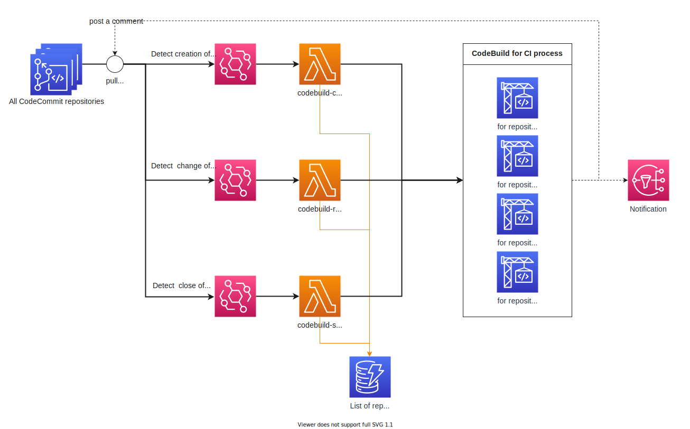

# Minimum example of CodeBuild triggered by pull requests.

# 🎃 Deprecated
A simpler method has been published. See [terraform-example-codebuild-triggered-by-pull-request-2](https://github.com/Jimon-s/terraform-example-codebuild-triggered-by-pull-request-2).

## Architecture


## How does it work?
This project adds daemon Lambda functions which monitor all pull requests in an AWS account.

1. when a pull request is created, `Lambda - creator` makes a new CodeBuild project tied to the pull request.

2. when a source branch is changed, `Lambda - runner` starts a new build. 

3. when the pull request is closed, `Lambda - sweeper` deletes the CodeBuild project. 
No worries! `Lambda - sweeper` doesn't delete build histories and logs.

## Install
```
cd ./terraform/env/example
make terraform-init
make terraform-apply-auto-approve
```

NOTE: In order to detect python source code update (for Lambda), this project uses some `make` commands. See [./terraform/env/example/Makefile](./terraform/env/example/Makefile) .

## Notification
This example supports two ways of notification.

1. **Comment notification**: CodeBuild adds a success/failure comment to the pull request after builds. This notification is insrumented by using aws cli. See buildspec.yml .

2. **SNS notification**: CodeBuild sends a message to a topic after builds. This notification uses AWS native notification function - CodeStar Notifications. You can subscribe the topic and make any functions you want (e.g. AWS Chatbot). 

## More
### Exclusion list
By default, daemon Lambda functions monitor all repositories. However, in some cases, you would like to exclude specific repositories.

You can do it by adding records to `DynamoDB - exclusion-table` .

| Attribute  | Value                                                                                                  |
| ---------- | ------------------------------------------------------------------------------------------------------ |
| repository | Repository name                                                                                        |
| branch     | Branch name you want to exclude. If you want to exclude all branches, you could specify `all` instead. |

## Reference
This project is inspilated by [CodeCommit × CodeBuildでプルリクエスト発行時に自動でCIが走るようにする | Zenn](https://zenn.dev/nekoze_climber/articles/930c40132e1d45). 
